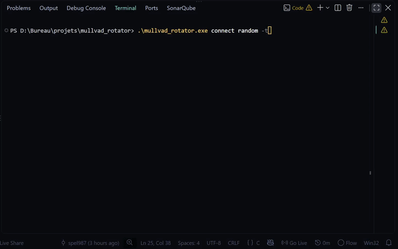

<div align="center">


# Mullvad Rotator

**Automatically rotate and filter Mullvad VPN relay servers**

[](https://github.com/spel987/mullvad_rotator/releases/latest)
[](https://github.com/spel987/mullvad_rotator)
[](https://github.com/spel987/mullvad_rotator/releases/latest)

</div>

---

## Features

- Connect to a random Mullvad relay server and switch every X seconds
- Connect to predefined Mullvad relay servers and switch every X seconds
- Filter only servers owned by Mullvad
- Filter only servers located in a specific country
- Option to use multihop

### Demonstration

A brief demonstration connecting to random relays and then to random relays located exclusively in Sweden:



## Prerequisites

- [Mullvad VPN](https://mullvad.net/download/vpn) installed on your system
- An active Mullvad account (logged in)

## Installation

### Download a prebuilt binary

Grab the latest executable for your platform: [latest release](https://github.com/spel987/mullvad_rotator/releases/latest)

### Build from source

```bash
# Clone the repository
git clone https://github.com/spel987/mullvad_rotator.git
cd mullvad_rotator

# Compile
make

# Run
./mullvad_rotator
```

> [!NOTE]
> On Windows, the build requires [MSYS2](https://www.msys2.org/) with `mingw-w64-ucrt-x86_64-gcc`, `mingw-w64-ucrt-x86_64-pcre2`, and `make`.

## Usage

```
Usage: mullvad_rotator <COMMAND> [SUBCOMMAND] [OPTIONS]

Commands:
  help                       Display this helper
  relay <COMMAND>            Count/list relays available for connection (<COMMAND>: count, list)
      count                  Display the number of relays available for connection
      list                   Display the list of all relays available for connection
  connect <random|NAMES>     Connect to a Mullvad relay server
      random                 Connect to a random relay server
      <NAMES>                Connect to one or more specific relay servers (separated by commas, with no space, examples of valid relay names: nl-ams-wg-007,no-osl-wg-002,se-sto-wg-014...)
      -t <SECONDS>           Specify the number of seconds for the server rotation (default: 120 seconds)

Options:
  --only-owned               Only use relays owned by Mullvad (excludes rented servers)
  --only-<COUNTRY>[-<CITY>]  Only use relays from a specific country (<COUNTRY>: the first two letters of each relay server's name, for example: fr, no, se...) and OPTIONALLY from a specific city within that country (<CITY>: the three letters identifying the city: par, sto, hel...)
  --multihop                 Enabling multihop (routing traffic through an entry relay and then an exit relay) works the same way, the two relays are chosen at random.
```

## Examples

### Connect to a random relay, rotate every 30 seconds

```bash
./mullvad_rotator connect random -t 30
```

### Only Mullvad-owned Swedish relays, rotate every 20 seconds

```bash
./mullvad_rotator connect random -t 20 --only-owned --only-se
```

### Only relays in Paris, rotate every 10 seconds

```bash
./mullvad_rotator connect random -t 10 --only-fr-par
```

### Cycle through 3 specific relays every 40 seconds

```bash
./mullvad_rotator connect fr-par-wg-101,se-mma-wg-011,jp-tyo-wg-202 -t 40
```

### Mullvad-owned relays with multihop, rotate every 100 seconds

```bash
./mullvad_rotator connect random -t 100 --only-owned --multihop
```

## Contributing

Contributions are welcome. Feel free to open an [issue](https://github.com/spel987/mullvad_rotator/issues) or submit a [pull request](https://github.com/spel987/mullvad_rotator/pulls).

## Note

This project started as a C learning exercise and turned into something actually usable. If you find it useful, a star on the repo is always appreciated. More features and improvements are coming.
